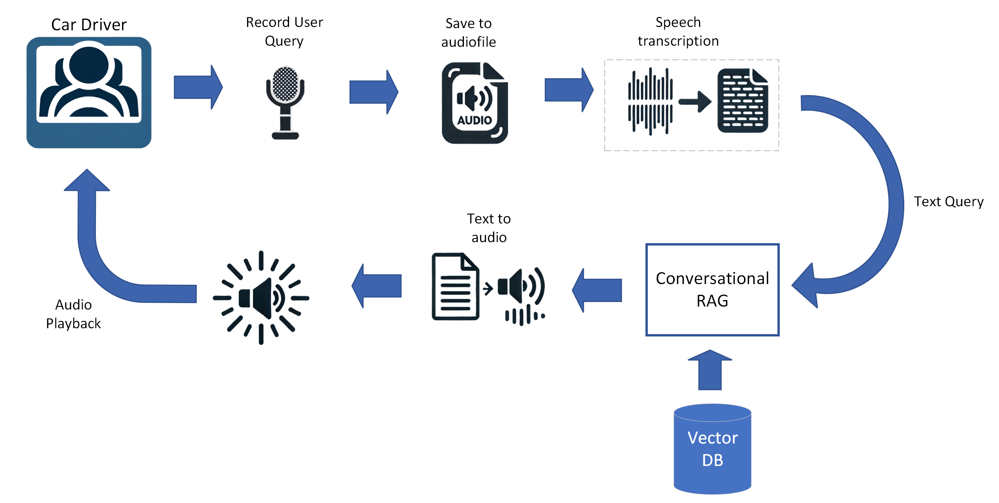
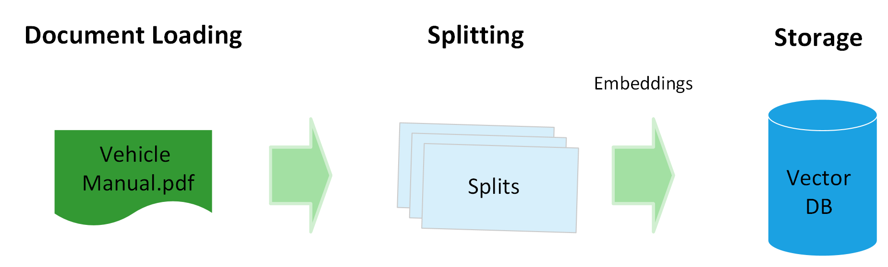
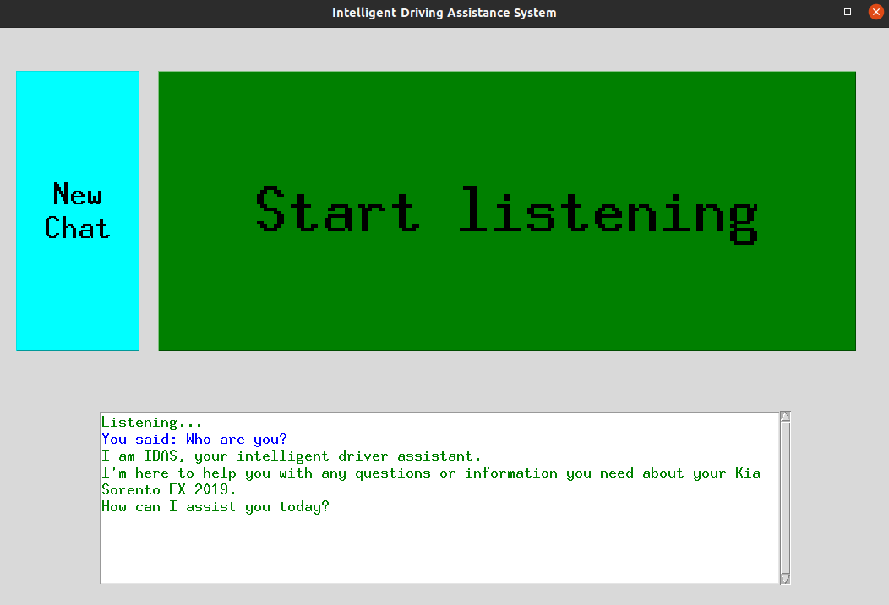
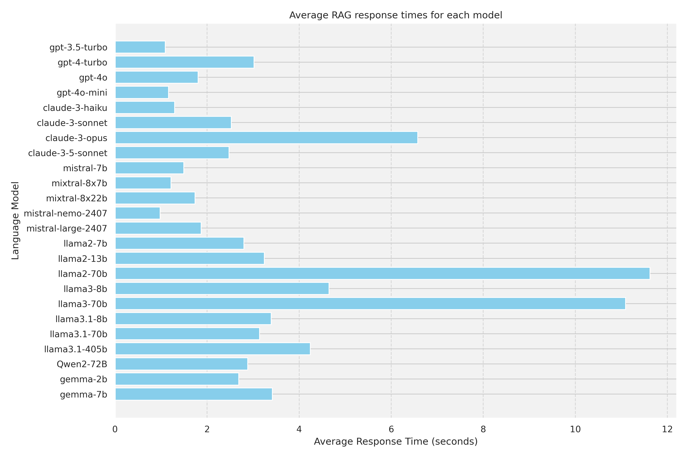

# IDAS: Intelligent Driving Assistance System

IDAS is an artificial intelligence system that connects drivers and their vehicles.
IDAS enables you to use voice commands to access various features of a car.
The primary component of IDAS is a Large Language Model (LLM), which, through retrieval augmented generation (RAG), can efficiently read and understand the car manual for immediate context-based aid. In addition, this system has speech recognition and speech synthesis capabilities, so it can understand commands given in different languages, improving user experiences among diverse driver communities.

The following figure shows the system diagram.

## IDAS steps:

### 1. Build your vector database
For this step, you can use the notebook located in notebooks/1_Vector Database Generation.ipynb

### 2. Conversational RAG
You can play with the question answering (notebooks/2_RAG_Question_answering.ipynb) 
or a conversational agent in notebooks/2.1_Conversational_RAG.ipynb.

### 3. Demo
A demo with GUI can be found inside /demo/idas_gui.py

## Requirements

* **LLM**: IDAS intelligence is based on a large language model. We tried several models shown in the figure below.
You will need an API key in order to use the LLM.
* **Speech-to-text**: we used OpenAI's Whisper as the transcription engine.
* **Text-to-Speech**: we used ElevenLabs as the TTS engine. You need to set an ElevenLabs API key.

## Contact information
**Main authors**
- Luis Bernardo Hernandez
- Juan Terven